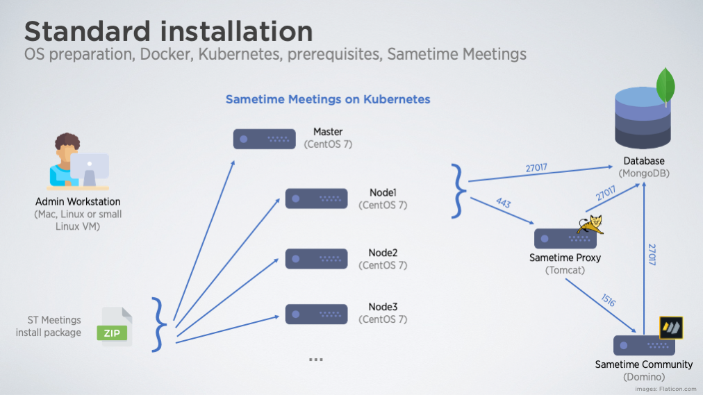
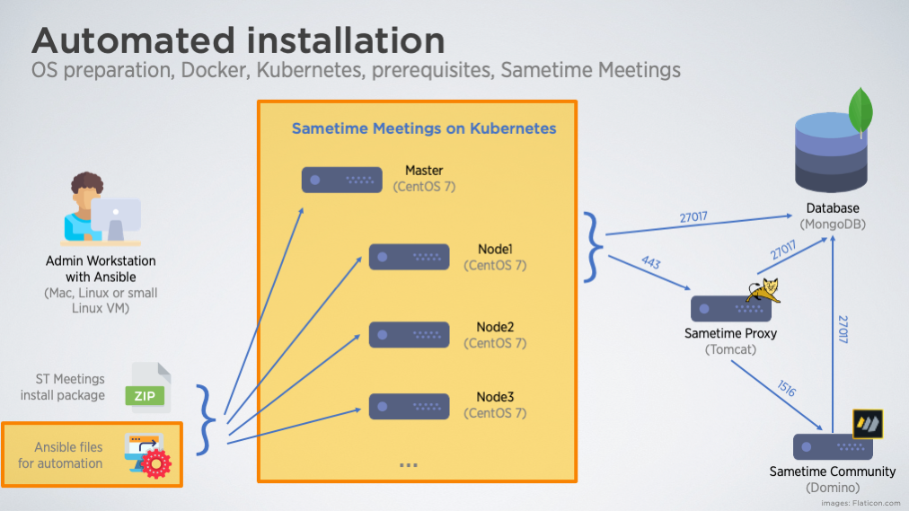

# HCL Sametime Meetings deployment on Kubernetes

A set of Ansible scripts for automated deployment of HCL Sametime Meetings on on-prem Kubernetes.

## Description
New HCL Sametime Meetings runs in a containerized environment - Docker or Kubernetes. Docker is suitable for smaller deployments and lower workload; deployment is easier. Sametime on Kubernetes is harder to deploy but can handle a bigger workload due to Kubernetes scaling possibilities.

When you decide to go with the Kubernetes platform, you can choose either the one offered by public cloud providers (Amazon, Google, Microsoft) or build your own Kubernetes environment yourself, on your premises.
This white paper describes the second option: building your Kubernetes cluster and deploying Sametime Meetings on it.\
> **Note:** If you prefer to use Kubernetes on a public cloud, check another white paper that describes deploying Sametime Meetings on AWS Kubernetes.

### Scripted automation

We expect that not all admins who would like to deploy Sametime Meetings on their premises are experienced in Kubernetes. Therefore we developed a script that will do an automatic installation and configuration. The script is written and Ansible.

The following image describes what you have to install when you want to deploy Sametime Meeting on-premises the standard way.

And this is where this automation script can help you - it does the orange part.

### What does the script do

  - Check the parameters you enter into a config file
  - Check the network connectivity and setup /etc/hosts file
  - Configure and update the operating system
  - Install necessary SW packages
  - Install and configure Docker
  - Install Kubernetes
  - Create Kubernetes cluster (one master + several worker nodes)
  - Install Kubernetes add-ons (logging, monitoring, dashboard)
  - Generate Let's Encrypt certificates for selected services
  - Unpack and modify Sametime Meetings installation package
  - Install Sametime Meetings

### What does the script does NOT do

  - Install MongoDB database - [link](https://help.hcltechsw.com/sametime/11.5/admin/installing_mongodb.html)
  - Install Sametime Community server - [link](https://help.hcltechsw.com/sametime/11.5/admin/installing_sametime_community.html)
  - Install Sametime Proxy server - [link](https://help.hcltechsw.com/sametime/11.5/admin/installing_sametime_proxy.html)
  - Enable MongoDB for Sametime Meetings usage (you will be instructed to do this manually) - [link](https://help.hcltechsw.com/sametime/11.5/admin/enable_mongodb_meeting.html)
  - Enable Sametime Community for Meetings - [link](https://help.hcltechsw.com/sametime/11.5/admin/enable_sametime_meeting.html)
  - Enable Sametime Proxy for Meetings - [link](https://help.hcltechsw.com/sametime/11.5/admin/enable_sametime_meeting_proxy.html)

## Quickstart
If you are ready, follow the instructions in the [QUICKSTART Guide](docs/QUICKSTART.md).

## Links
- [Official documentation](https://help.hcltechsw.com/sametime/11.5/admin/meeting_server.html)

## Author and Contributor Information
Petr Kunc, HCL Software\
Steven Wong, HCL Software

## License

This project is licensed under Apache 2.0 license.

## Disclaimer

This product is not officially supported and can be used as-is. This product is only proof of concept, and HCL Technologies Limited would welcome any feedback. HCL Technologies Limited does not make any warranty about the completeness, reliability, and accuracy of this code. Any action you take by using this code is strictly at your own risk, and HCL Technologies Limited will not be liable for any losses and damages in connection with the use of this code.
