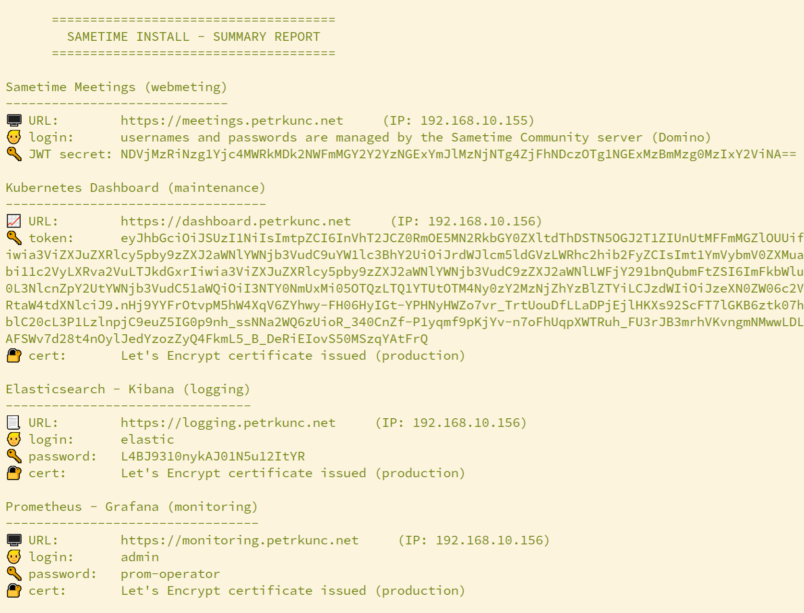

# Quickstart for setting up HCL Sametime Meetings using Ansible automation

## Requirements
Although the installation is automatic, you need to fulfill some requirements to make it run smoothly.

### HW and SW requirements
Kubernetes cluster runs on nodes. A node is a physical or virtual machine; these days, it is usually a virtual machine (in a virtual environment like VMWare or Hyper-V). The script was created and tested on a set of VMWare virtual machines (one Admin Workstation, one Master Node, four Worker Nodes).\
Each node should have at least 4 cores and 12 GB RAM -- this is a minimal environment where you can install and test Sametime Meetings. For production, you would use more cores and more RAM.

The operating system on these virtual machines (VMs) has to be Linux - RedHat-based (RHEL or CentOS).\
> **Important:** The first version of the Ansible script is written and tested only on Centos 7.\
So, if you want to use the script now, **install the latest version of CentOS 7 on your virtual machines.**

The script will deploy Sametime Meetings only. We expect that you have already installed Sametime Community and Sametime Proxy. Install Community and Proxy servers on separate VMs; do not use the VMs you created for Kubernetes.
**Note:** Sametime Community and Sametime Proxy can run on Windows. You do not need to move everything to Linux; Kubernetes nodes have to run on Linux.

### Knowledge requirements
The administrator who performs Sametime Meetings deployment (and who is reading this book) should have the following knowledge:

  - Sametime: how are components (Community, Proxy, Meetings) interconnected
  - MongoDB: basic knowledge, ability to enter commands
  - Networking: basic knowledge (hostnames, IP addresses, routing)
  - Linux: basic commands
  - Docker and Kubernetes: principles of containers, principles of containers orchestration in Kubernetes
  - Ansible: principles of automation

---

# A. Prepare the infrastructure

This chapter will describe how to prepare the environment where you can run the deployment script.
You will follow the steps:

  1. Design architecture and networking
  2. Create a Linux VM template
  2. Clone the template into 5-6 virtual machines
  3. Setup one VM as Admin Workstation


**Important:**

  - All virtual machines need a static IP address. It should not change during the time.
  - All Kubernetes nodes have to be accessible via a hostname (example: _master.example.com_). You can either use DNS or static hosts files. The script allows you to set hostnames on all nodes automatically.

## 1. Design architecture
Kubernetes infrastructure consists of multiple nodes. Before you start working on virtual images, you should write down info about your planned infrastructure. You have to decide on:
  - Virtual machine hostnames
  - Hostnames for exposed services
  - IP addresses for virtual machines
  - A set of free IP addresses for services

It is an important decision, and it is described in detail in dedicated [page](networking.md).


## 2. Linux image template
Since we will need to create at least 5 virtual machines with the same operating system, creating one image and clone it (copy-paste) into multiple instances is better.

Create a Linux VM template:

  - operating system: CentOS 7.9 Minimal
  - 4 CPU cores, 12 GB RAM, 200 GB HDD
    - Disk partitioning: /boot = 1024 MiB, swap = 2048 MiB, / = 196,00 GiB
  - enable network, keep default hostname: _localhost.localdomain_
  - remember root password
  - update packages to the latest version: `yum update`

## 3. Clone all virtual machines
You have a Linux template with CentOS 7; now clone it into 5-6 new virtual machines.\
Each new VM has to have a unique MAC address on its virtual network interface.\
Write down a list of IP addresses and hostnames, like this one:
```
  192.168.10.139 ... ansible.example.com
  192.168.10.140 ... master.example.com
  192.168.10.141 ... node1.example.com
  192.168.10.142 ... node2.example.com
  192.168.10.143 ... node3.example.com
  192.168.10.144 ... node4.example.com
```
Start each of the virtual machines (Admin Workstation, Master, and all Worker nodes) and perform the following steps:

  - Log in as **root**.
  According to the list, check if the IP address is set up correctly (you can assign the MAC address to the desired IP address for leasing in the DHCP server). Use the following commands to get the IP address:

    `ip address`\
    `hostname -I`
  - Change hostname from localserver.localhost to the new name, according to your list of IPs and hostnames. Example:

    `hostnamectl set-hostname ansible.example.com`
  - Check if you set the hostname correctly:

    `hostname -f` ... returns _ansible.example.com_
  - Check if the hostname resolves correctly to the IP address:

    `ping ansible.example.com`

At the end of this chapter, your environment should look like this:


## 4. Admin Workstation
You, as an admin, would need a workstation from where you will control the whole environment. The workstation must have direct connectivity to all Kubernetes nodes via SSH. If your personal workstation is on Linux or macOS, you can use it; otherwise, you must assign one of the virtual machines as your workstation.\
In the following, I assume that you will promote one of the newly created VMs as your workstation. The hostname for Admin Workstation is _ansible.example.com_.

  - Log in as **root**.
  - Make sure that you can resolve (ping) all hostnames from this Admin Workstation. If you do not use a DNS server, you have to update `/etc/hosts` file. Example:
```
    192.168.10.140  master.example.com
    192.168.10.141  node1.example.com
    192.168.10.142  node2.example.com
    192.168.10.143  node3.example.com
    192.168.10.144  node4.example.com
```
  - Create a new user with the name **ansible** and set his password. (You can choose a different name if you want. Ansible user name and password are stored in a config file `setup-ansible-user/defaults/main.yml`)

    `adduser ansible`\
    `passwd ansible`
  - Set ansible user as an account that can sudo without typing password for every sudo command:

    `visudo`

    Scroll down and add the following line to the section _"## Same thing without a password"_:\
      `ansible ALL=(ALL)       NOPASSWD: ALL`
    > **Note:** The command launches vi editor. Enter edit mode with the key "i". You can exit _vi_ editor with this keyboard sequence: Escape, :, w, q, Enter
  - Test if you set sudo rights correctly:

    `su - ansible` ... you shout not be asked for a password\
    `sudo whoami` ... you should see: _root_\
    `sudo ls -la /root` ... you should see the content of the folder

At the end of this chapter, your environment should look like this:


---
# B. Upload install files
Now is the time to upload the install files.\
Although you will install Kubernetes and Sametime on virtual machines dedicated to Kubernetes (master and workers), you upload Sametime installation files and Ansible scripts only on the Admin Workstation. Ansible script will then copy and unzip Sametime install files from a workstation to remote servers automatically; you do not take care of it.

- Log in to Admin Workstation as **ansible** user.
- Install the unzip package:

  `sudo yum install unzip`

- Download a package with Ansible scripts from the GitHub repository:
  https://github.com/HCL-TECH-SOFTWARE/Sametime-Automation

  Link to the zip file:
  https://github.com/HCL-TECH-SOFTWARE/Sametime-Automation/archive/refs/heads/main.zip

- Upload this ZIP file to your Admin Workstation.
  > **Note:** If you have troubles with uploading and unpacking a ZIP file with the script because your main workstation is on Windows, read the [detailed instructions](copy_to_linux.md).

- Unzip the package, then rename the folder to a shorter name:

  `cd ~`\
  `unzip Sametime-Automation-main.zip`\
  `mv Sametime-Automation-main sametime`

- You just created a directory (`/home/ansible/sametime`) where all Ansible-related stuff is stored -- config files and Ansible scripts (they are called playbooks).\
  Check that the directory structure is correct. This should be the content of directory `~/sametime`:
```ShellSession
  [ansible@ansible sametime]$ cd ~/sametime
  [ansible@ansible sametime]$ pwd
  /home/ansible/sametime
  [ansible@ansible sametime]$ ll
  total 68
  -rw-rw-r--.  1 ansible ansible 20005 May 18 15:16 ansible.cfg
  -rw-rw-r--.  1 ansible ansible   128 May 18 15:16 check_connectivity.yml
  -rw-rw-r--.  1 ansible ansible  4015 May 18 15:16 CODE_OF_CONDUCT.md
  drwxrwxr-x.  3 ansible ansible   129 May 18 15:16 docs
  -rw-rw-r--.  1 ansible ansible   495 May 18 15:16 inventory.example.yml
  -rw-rw-r--.  1 ansible ansible 11347 May 18 15:16 LICENSE
  -rw-rw-r--.  1 ansible ansible   925 May 18 15:16 main.yml
  -rw-rw-r--.  1 ansible ansible  3828 May 18 15:16 README.md
  drwxrwxr-x. 15 ansible ansible  4096 May 18 15:16 roles
  -rw-rw-r--.  1 ansible ansible   635 May 18 15:16 setup_ansible_user.sh
  -rw-rw-r--.  1 ansible ansible   125 May 18 15:16 setup_ansible_user.yml
  -rw-rw-r--.  1 ansible ansible   119 May 18 15:16 setup_hosts.yml
  drwxrwxr-x.  2 ansible ansible    50 May 18 15:16 vars
```

You uploaded and extracted a ZIP file with Ansible automation scripts. Now you will upload the installation package for Sametime Meetings itself.
- Download the package from Flexnet. The file name should be `Sametime_11.5_MeetingServer.zip`.
- On Admin Workstation, create directory `package` within your _~/sametime/_ directory:

  `mkdir ~/sametime/package`
- Upload `Sametime_11.5_MeetingServer.zip` into this package subdirectory.
- Do NOT unpack the ZIP package; the Ansible script will do it.

At the end of this chapter, your environment should look like this (_Sametime.zip_ on the picture represents `Sametime_11.5_MeetingServer.zip` package):


---

# C. Setup Ansible
This chapter will describe how to set up and configure Ansible on your Admin Workstation.\
You will perform these steps:

  1. Install Ansible
  3. Configure access to nodes


## 1. Install Ansible on Admin Workstation
> **Important:** Perform the following steps only on virtual image assigned as Admin Workstation. Do not do this on other VMs.

  - Log in as **ansible** user (not root!). Since now you will do everything as _ansible_ user; the user has sudo rights, so you will use sudo when necessary.
  - Ansible SW package is in _EPEL repository_ (Extra Packages for Enterprise Linux), not in the default CentOS repository. Add EPEL repository to yum (confirm the installation and EPEL repository GPG key):

    `sudo yum install epel-release`
  - Install Ansible package:

    `sudo yum install ansible`
  - Check that Ansible is installed:

    `ansible --version`
  ```ShellSession
    ansible 2.9.21
    config file = /home/ansible/sametime/ansible.cfg
    configured module search path = [u'/home/ansible/.ansible/plugins/modules', u'/usr/share/ansible/plugins/modules']
    ansible python module location = /usr/lib/python2.7/site-packages/ansible
    executable location = /bin/ansible
    python version = 2.7.5 (default, Nov 16 2020, 22:23:17) [GCC 4.8.5 20150623 (Red Hat 4.8.5-44)]
  ```
  - Update all yum packages:

    `sudo yum update`

  - Create an Ansible inventory file. This file is the heart of your Ansible environment. It contains info about all the servers you want to manage with your Ansible scripts.
    - Use an example inventory file to create your own:

      `cd ~/sametime`\
      `cp inventory.example.yml inventory.yml`
    - Edit `inventory.yml` and fill in the hostnames of your Master and Worker nodes.\
      > **Note:** Do not add an entry for Admin Workstation. You will do all commands from this workstation, and Ansible script can access it locally.\
      > **Important:** This is a YAML file. All Ansible script files are YAML files. In YAML always use spaces for indentation; never use tab!

    Example content of `inventory.yml`:
  ```YAML
  all:
    hosts:
    children:
      masters:
        hosts:
          master:
            ansible_host: master.example.com
      workers:
        hosts:
          node1:
            ansible_host: node1.example.com
          node2:
            ansible_host: node2.example.com
          node3:
            ansible_host: node3.example.com
          node4:
            ansible_host: node3.example.com
  ```
  - Congratulation! You just set up your first ansible environment! Let's try some first commands. First, you have to be in your Ansible directory (`~/sametime`); otherwise, Ansible will not find your config and inventory file.

(Optional) If you want, you can now try Ansible now:

  - First, you have to accept remote server fingerprint:

    `ssh root@master.example.com`
  - Now, try your first Ansible command:

    `ansible masters -m ping -u root --ask-pass`

    This will test if you can access (via SSH) the master node. You should see something like this:
  ```YAML
  master | SUCCESS => {
      "ansible_facts": {
          "discovered_interpreter_python": "/usr/bin/python"
      },
      "changed": false,
      "ping": "pong"
  }
  ```
  As you see, it is not very practical to specify a remote user name and password in each command that we plan to use. Therefore you will set up SSH access to remote servers without a password in the following chapter (instead of a password, you will use an SSH key).

At the end of this chapter, your environment should look like this:


## 2. Configure access to nodes
Ansible uses SSH to connect to other servers. For this, you need a user account on the remote server. We will use user account _ansible_, which you created in the previous chapter.\
For SSH connectivity, you need either password of the remote user or SSH keys stored on both parts (Admin Workstation and a remote server). SSH keys are better because they will allow us to connect to a remote server without typing a password. And this is what we need to run our scripts.\
The good thing is that for this step, we can use Ansible automation.

  - You are still logged as **ansible** user.
  - First, you need to generate a pair of SSH keys (keep the default values, click on **Enter** three times):

    `ssh-keygen`
  ```ShellSession
    Generating public/private rsa key pair.
    Enter file in which to save the key (/home/ansible/.ssh/id_rsa):
    Enter passphrase (empty for no passphrase):
    Enter same passphrase again:
    Your identification has been saved in /home/ansible/.ssh/id_rsa.
    Your public key has been saved in /home/ansible/.ssh/id_rsa.pub.
    The key fingerprint is:
    SHA256:rnpVasilBx1WRFG5v6wvUAFKc7wri16pnAAw5RpO8xM ansible@ansible.example.com
    The key's randomart image is:
    +---[RSA 2048]----+
    |  .     o=B+..   |
    | o     .o+. o    |
    |+o.E   o.. . o   |
    |o=o . . o o o    |
    |...o . =So o .   |
    |   .. +.*.o   .  |
    |    .  =+o . . . |
    |     oo=.   . o  |
    |    .+*     .+.  |
    +----[SHA256]-----+
  ```
  - Then, you need to confirm the SSH fingerprints of all remote servers. Type this command for all remote servers:

    `ssh root@master.example.com`\
    `ssh root@node1.example.com`\
    `ssh root@node2.example.com`

  Confirm the fingerprint for each server.
```ShellSession
  [ansible@ansible sametime]$ ssh root@master.example.com
  The authenticity of host 'master.example.com (192.168.10.140)' can't be established.
  ECDSA key fingerprint is SHA256:ZNMV+RD2nIMNtm+nu93rvAFBS9K0qWzSotYRsvlHVX0.
  ECDSA key fingerprint is MD5:73:54:fc:4c:d1:b7:30:84:9f:7d:05:f1:50:25:d5:bc.
  Are you sure you want to continue connecting (yes/no)? yes
  Warning: Permanently added 'master.example.com,192.168.10.144' (ECDSA) to the list of known hosts.
  root@master.example.com's password:
  Last login: Sun Jun  6 10:28:11 2021 from 192.168.10.1
  [root@master ~]#
```
  - You successfully logged in to the remote server. Now you can close this session:

      `exit`

>  **Note:** you do not need to finish the ssh command once you approve the fingerprint. You can cancel your login using CTRL+C.

  - Now, you need to do two things on each remote server: create user _ansible_, add sudoer's right to it, and copy your public key from Admin Workstation to a remote server. You can do it manually, or you can use an Ansible script.
  - If you choose **manual steps**:
    - On a remote server (for example _master.example.com_) do the same commands as you did on the Admin Workstation: `adduser ansible`, `passwd ansible`, `visudo`
    On the workstation, try to connect manually: `ssh ansible@master.example.com` and then type a password for the ansible user.
    - On the workstation, copy SSH keys for _ansible_ user to the remote server:

      `ssh-copy-id -i ~/.ssh/id_rsa.pub master.example.com`
  - If you choose **using the script**:
      - In the script directory on the Admin Workstation, edit the config file `roles/setup-ansible-user/defaults/main.yml`. You can keep the default username (_ansible_) and change the _password_ parameter. The password you set here will be used for creating _ansible_ user on a remote server.
      - Go to a directory with Ansible script:

        `cd ~/sametime`
      - Set the helper script file as executable:

        `chmod u+x setup_ansible_user.sh`.
      - Run the helper script:

        `./setup_ansible_user.sh master`.

        _"master"_ is a node name from the Ansible inventory file (_hosts_). When asked, type the password for a root account on the remote server.
      - Use the script for all remote servers; use node name as a parameter. In the example case, it would be:

        `./setup_ansible_user.sh node1`\
        `./setup_ansible_user.sh node2`\
        ...
  - After you perform manual or automatic SSH configuration, check if you did it correctly:

    `ssh ansible@master.example.com`\
    `whoami`

    ... The response should be: _ansible_, and you should NOT be asked for a password.

    `exit`\
    `ssh master.example.com`\
    `whoami`

    ... The same as above.


    Now you can perform that simple ansible command again, this time without specifying username (_root_) and password. Ansible will use in SSH connectivity currently logged user on Admin Workstation (which is user _ansible_). It will not ask you for a password because it now uses the SSH personal key instead, which you just distributed to all remote servers.

    `ansible masters -m ping`\
    `ansible all -m ping`

  - (Optional) Try other simple Ansible commands:

    `ansible --list-hosts all`\
    `ansible all -m shell -a "hostname -f"`\
    `ansible masters -m setup`

At the end of this chapter, your environment should look like this:


---

# D. Run the scripts
You prepared the nodes and configured Ansible on the Admin Workstation to connect to all nodes via ssh, without entering a password. Now is the time when you start performing steps towards Sametime Meetings installation.\
You will perform these steps:

1. Create snapshots
2. Configure Sametime user in MongoDB
3. Set environment values
4. Setup network connectivity
5. Check the environment
6. Run the main install script

## 1. Create snapshots
It is an important task. So far, you finished the basic configuration of all virtual machines, installed and configured Ansible on the Admin Workstation, and set up ssh connectivity from the workstation to all servers.
Now is the time to make snapshots on all of your virtual machines (Admin Workstation, Master, and Worker Nodes).

Trust me; you will need it.

The beauty of automation is that you can run it as many times as you want. I develop the script that you can run it multiple times -- so if the script fails during the run, you can find the cause, fix it, and run the script again from the beginning. The cause for the failure could be some misconfiguration, wrong hostnames, IP addresses, usernames, or passwords.\
Sometimes, it could be better to revert to this snapshot and start again with the correct configuration.

The great part is that you only revert VMs with Kubernetes nodes, not Admin Workstation. Together with your custom configuration and parameters, the script is stored on the workstation, so you can quickly start again and let it deploy everything.

## 2. Enable MongoDB for Sametime Meetings usage
Sametime Meetings stores some info into the MongoDB database. Since Sametime Community and Sametime Proxy also use the MongoDB database, you use the same for Sametime Meetings. It is the easiest way; if you go this way, do not forget to open the MongoDB port (from all Sametime Meetings nodes to MongoDB server) in your firewall.

> **Note:** You can also decide to deploy a new MongoDB server dedicated just for Sametime Meetings. MongoDB installation is not part of this guide, but you can follow the detailed description in the official Sametime documentation.

Whether you decide to use an existing or new MongoDB server, you have to do:
- Follow the instructions from the [documentation](https://help.hcltechsw.com/sametime/11.5/admin/enable_mongodb_meeting.html) (create/grant access for Sametime database user).
- Write down values that you will enter into a script config file:
  - IP address of the MongoDB server
  - port used to access the MongoDB server (default _27017_)
  - Sametime user name (default _sametimeUser_)
  - Sametime user password


## 3. Edit environment variables
The install script runs automatically, but it needs initial configuration because each environment differs.
Now you have to set all variables in file _vars.yml_. This file is located in the folder where you extracted script install files (`~/sametime`). It is in the subfolder `vars`, so the full path is `~/sametime/vars/vars.yml`

First, create your own _vars.yml_ file from the example file:

`cd ~/sametime/vars`
`cp vars.example.yml vars.yml`

Now you can edit `vars.yml` file. First, fill in the IP address of other Sametime components (Proxy server, MongoDB server). Next, enter a range of IP addresses that Kubernetes will use for exposing their services outside the cluster.

> **Note:** Next to the vars.yml, a file `defaults.yml` is in the same folder. You do not need to edit values in this file. It contains parameters shared by multiple script modules (roles), and you should change them only if you know what you are doing. On the other hand, you should inspect and update every parameter in `vars.yml`, because this config file contains parameters that describe your unique environment.

## 4. Setup network connectivity
In the Kubernetes cluster, each node has to be able to connect to other cluster members. It means each node has to resolve hostnames to IP addresses and "ping" other nodes.
If you provide resolving via an internal DNS server, you just set this DNS server in network config on each of the nodes (Master and Workers).\
If you cannot use an internal DNS server, you have to configure resolving via static `/etc/hosts` files on each node. And this is a good use case for Ansible: you can run a script that will configure hosts files automatically. It will not only save your time but also avoids misconfiguration caused by typos.
- Go to the main script folder

  `cd ~/sametime`
- First, check the current status of inter-nodes connectivity:

  `ansible-playbook check_connectivity.yml`

  You should see errors, and it is OK in this phase.
- Second, run a script that adds new lines into `/etc/hosts` on each node:

  `ansible-playbook setup_hosts.yml`

  You should see messages that files have been updated.
- Third, recheck inter-nodes connectivity:

  `ansible-playbook check_connectivity.yml`

  Now you should see only OK messages, no errors. There is probably misconfiguration in your Ansible inventory file, or the network between nodes is not open if you see errors.

> **Note:** This script will add cluster nodes' IP addresses into the hosts file and IP addresses for Sametime Proxy and Mongo DB (the script will take them from `vars.yml` config file).

## 5. Check the environment
Running this step is an option but highly recommended. The script _check_environment_ will inspect the values you set in the `vars.yml` config file. If there is a problem, the script will write a warning. You can then fix the value in `vars.yml` and rerun the script until it finishes without an error.

Run this on Admin Workstation:

  `cd ~/sametime`\
  `ansible-playbook main.yml --tags "check_environment"`


## 6. Run the main install script
Continue with the installation only if you fulfilled all the prerequisites:
- You created and snapshotted at least 4 virtual machines (nodes) with CentOS 7.
- You configured ssh to allow ansible user to access these machines.
- You set up and checked network connectivity between nodes.
- You set up up your environment parameters in `vars.yml`.
- You installed Sametime Community and Sametime Proxy (not covered in this document).

If you did not do everything yet, please follow the instructions in the previous chapters.

As _ansible_ user go to `~/sametime/` directory.
Start the main install script by running the command:

`ansible-playbook main.yml`

That's it, just this one command. Now sit and watch it do the hard work. It will take about 20 minutes until the script will perform all the steps.

**Note:** If you want to see more details during the script execution, start the script with verbose mode:

`ansible-playbook main.yml -v`

If the script finishes successfully, you will see the final installation report. It contains:
- URLs for accessing exposed services (hostname and IP address)
- user name and password (or token) for each service
- info whether the script created Let's Encrypt certificate for the service (production or staging)

The report should look like this:



There is a chance that the script does not run successfully until the very end. It is NOT a problem. The script is composed the way that you can run it over and over again until it finishes with success.\
The cause of the script failure will probably be some misconfiguration in vars.yml file. Read the error message, locate where in the script the problem occurred. The script is organized in a logical sequence: prepare the operating system, install Docker and Kubernetes, create Kubernetes cluster, install Kubernetes add-ons, upload and unzip Sametime install package, install Sametime Metings.\
Try to find out the cause of the problem, fix it, and rerun the script.

At the end of this chapter, your environment should look like this:


